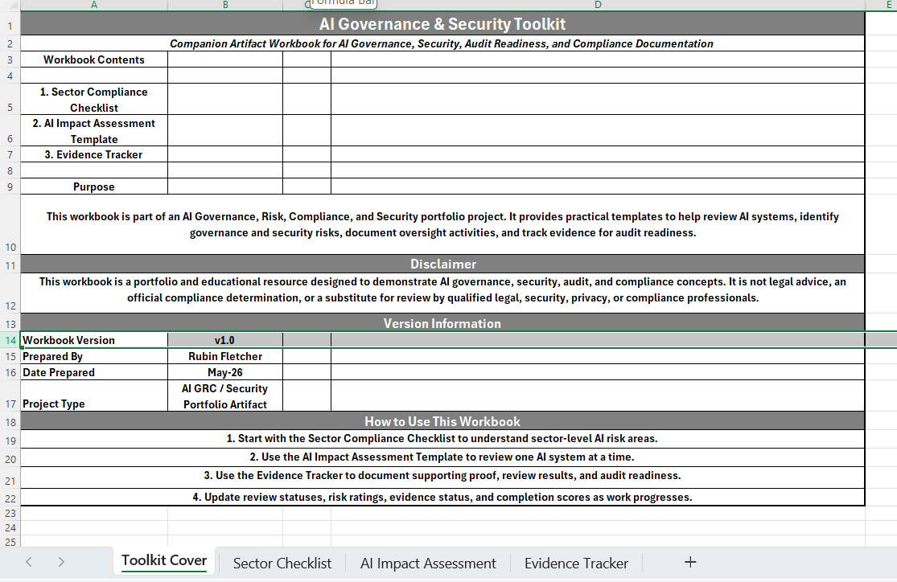
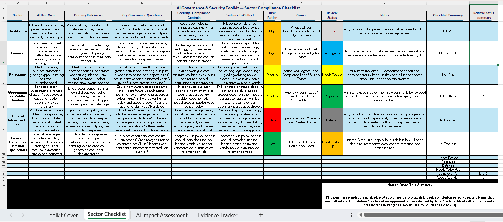
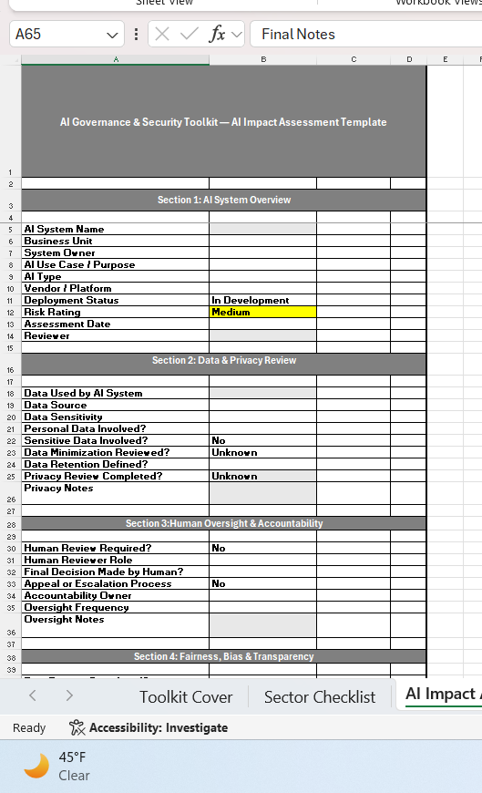
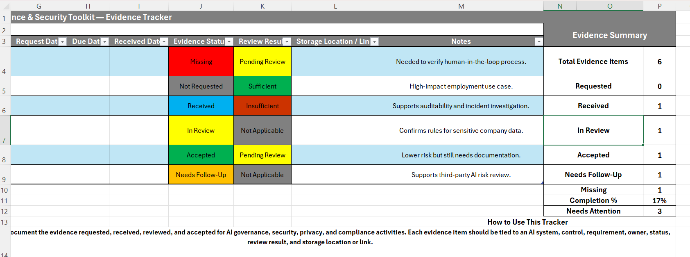

# AI Governance & Security Toolkit
## Project Overview
The AI Governance & Security Toolkit is a portfolio project designed to turn AI governance, security, audit, and compliance concepts into practical working artifacts. The workbook includes templates that help identify AI risk areas, assess AI systems, document oversight activities, and track evidence for audit readiness.

This project supports responsible AI adoption by connecting governance questions, security controls, human oversight, data privacy, fairness, transparency, and evidence collection into one structured toolkit.

## Workbook Artifacts

This toolkit includes:

1. Sector Compliance Checklist
2. AI Impact Assessment Template
3. Evidence Tracker
4. Toolkit Cover Sheet

## Purpose

The purpose of this toolkit is to demonstrate how AI governance and security concepts can be translated into practical review tools. Instead of only discussing responsible AI at a policy level, this project shows how organizations can document AI systems, assess risk, assign ownership, review controls, and collect evidence for audit readiness.

This toolkit is designed as a portfolio artifact for AI governance, risk, compliance, cybersecurity, and responsible AI work.

## What This Toolkit Demonstrates

This project demonstrates the ability to:

- Translate AI governance concepts into practical business artifacts
- Identify AI risk areas across different sectors
- Review AI systems for privacy, fairness, transparency, human oversight, and security concerns
- Track supporting evidence for audit readiness
- Connect AI governance, cybersecurity, compliance, and risk management into one structured workflow
- Build portfolio-ready documentation that can be reviewed by technical and non-technical audiences

## How to Open the Workbook

The main Excel workbook is located in the `workbook` folder:

`workbook/AI-Governance-Security-Toolkit-v1.xlsx`

Download the workbook and open it in Microsoft Excel to use the dropdown lists, filters, conditional formatting, summary dashboards, and evidence tracking features.

## Workbook Structure

The workbook is organized into three main working artifacts and one cover sheet:

### 1. Toolkit Cover Sheet
Provides the workbook title, purpose statement, disclaimer, version information, and instructions for how to use the workbook.

### 2. Sector Compliance Checklist
Helps review AI governance and security expectations across different sectors, including healthcare, finance, employment, education, government/public services, critical infrastructure, and general business use.

### 3. AI Impact Assessment Template
Provides a structured template for reviewing one AI system at a time. It includes sections for system overview, data and privacy review, human oversight, fairness and transparency, security and access review, and final assessment decision.

### 4. Evidence Tracker
Tracks evidence requested, received, reviewed, and accepted for AI governance, security, privacy, compliance, and audit readiness activities.

## Example Use Cases

This toolkit could be used to support:

- AI system inventory and review
- AI governance program development
- AI security and privacy assessments
- Responsible AI review workflows
- Audit readiness documentation
- Vendor AI risk review
- Human oversight and accountability checks
- Sector-specific AI risk analysis

## Skills Demonstrated

This project demonstrates practical skills in:

- AI governance, risk, and compliance documentation
- AI security and privacy review
- Audit readiness and evidence tracking
- Risk rating and control review workflows
- Human oversight and accountability design
- Fairness, bias, and transparency assessment
- Vendor and third-party AI risk review
- Excel-based compliance tool development
- Portfolio-ready technical documentation

## Screenshots

### Toolkit Cover Sheet

### Sector Compliance Checklist

### AI Impact Assessment Template

### Evidence Tracker

## Future Improvements

Future improvements for this toolkit may include:

- Adding a formal AI system inventory tab
- Mapping controls to frameworks such as NIST AI RMF, ISO/IEC 42001, OWASP LLM Top 10, and MITRE ATLAS
- Adding a risk scoring model for AI systems
- Adding automated dashboard charts for risk rating, evidence status, and assessment completion
- Creating sector-specific versions for healthcare, finance, education, government, employment, and critical infrastructure
- Expanding the evidence tracker to include control testing results and reviewer sign-off
- Building a companion AI security incident response playbook

## Disclaimer

This project is a portfolio and educational resource designed to demonstrate AI governance, security, audit, and compliance concepts. It is not legal advice, an official compliance determination, or a substitute for review by qualified legal, security, privacy, or compliance professionals.

All example data, AI systems, controls, evidence items, and scenarios are fictional and created for demonstration purposes.

